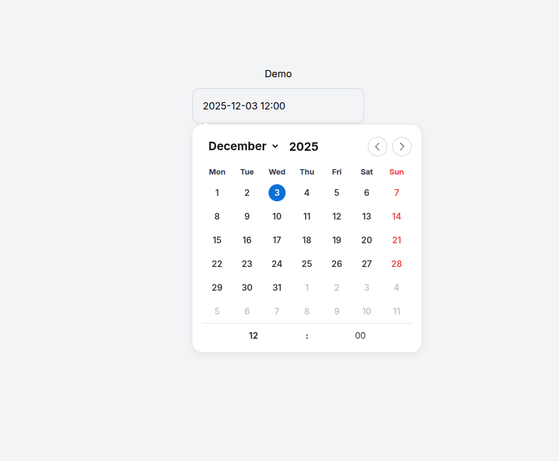

# Flatpickr Elegant Theme

A flatpickr plugin with an elegant theme and Sunday highlight feature.



- **Elegant Theme**: Modern and clean visual design for flatpickr
- **Sunday Highlight**: Automatically highlights Sundays

## 📦 Installation

### Via NPM

```bash
npm install flatpickr-elegant-theme
```

### Via CDN

```html
<!-- CSS -->
<link
  rel="stylesheet"
  href="https://cdn.jsdelivr.net/npm/flatpickr-elegant-theme/dist/flatpickr-elegant-theme.css"
/>

<!-- JavaScript -->
<script src="https://cdn.jsdelivr.net/npm/flatpickr-elegant-theme/dist/flatpickr-sunday-highlight-plugin.umd.js"></script>
```

## 🚀 Usage

### Basic Usage

```javascript
import flatpickr from "flatpickr";
import SundayHighlightPlugin from "flatpickr-elegant-theme";
import "flatpickr-elegant-theme/dist/flatpickr-elegant-theme.css";

flatpickr("#calendar", {
  plugins: [SundayHighlightPlugin()],
});
```

### With Custom Options

```javascript
flatpickr("#calendar", {
  plugins: [
    SundayHighlightPlugin({
      sundayClass: "custom-sunday-class",
      weekdayClass: "custom-weekday-class",
    }),
  ],
});
```

### HTML

```html
<!DOCTYPE html>
<html>
  <head>
    <link
      rel="stylesheet"
      href="https://cdn.jsdelivr.net/npm/flatpickr/dist/flatpickr.min.css"
    />
    <link rel="stylesheet" href="path/to/flatpickr-elegant-theme.css" />
  </head>
  <body>
    <input id="calendar" type="text" placeholder="Select date..." />

    <script src="https://cdn.jsdelivr.net/npm/flatpickr"></script>
    <script src="path/to/flatpickr-sunday-highlight-plugin.js"></script>
    <script>
      flatpickr("#calendar", {
        plugins: [SundayHighlightPlugin()],
      });
    </script>
  </body>
</html>
```

## ⚙️ Plugin Options

| Option         | Type     | Default               | Description                               |
| -------------- | -------- | --------------------- | ----------------------------------------- |
| `sundayClass`  | `string` | `"fp-sunday"`         | CSS class for Sunday days in the calendar |
| `weekdayClass` | `string` | `"fp-weekday-sunday"` | CSS class for Sunday header               |

## 🎨 CSS Customization

You can override default styles by adding custom CSS:

```css
/* Change Sunday highlight color */
.flatpickr-day.fp-sunday {
  background-color: #your-color;
  color: #your-text-color;
}

/* Change Sunday header style */
.flatpickr-weekday.fp-weekday-sunday {
  color: #your-color;
  font-weight: bold;
}
```

## 📄 License

MIT License - see the [LICENSE](LICENSE) file for full details.

---

Give a ⭐️ if this project helped you!

Happy Coding
